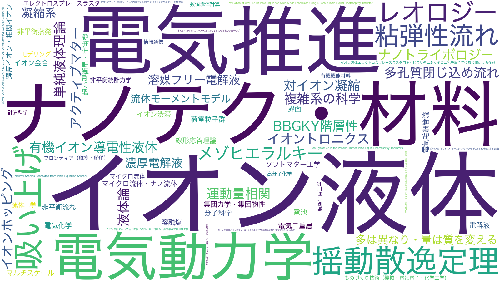

  
  
  

Researching space propulsion, especially ionic liquid electrospray thrusters. Interested in developing theoretical models of ion dynamics in the liquid state.

宇宙推進機の研究をしています。特に、超小型・高効率な推進性能が期待できるイオン液体エレクトロスプレースラスタという電気推進（イオンエンジン）を扱っています。イオン液体・濃厚電解液のイオンダイナミクスに興味があります。

  

web article 1 -> https://www.isas.jaxa.jp/topics/003764.html

web article 2 -> https://www.isas.jaxa.jp/home/research-portal/people/2025/1006/?utm_source=isasweb&utm_medium=content&utm_campaign=links

CV([Japanese](./CV_jp.pdf))/(English)
