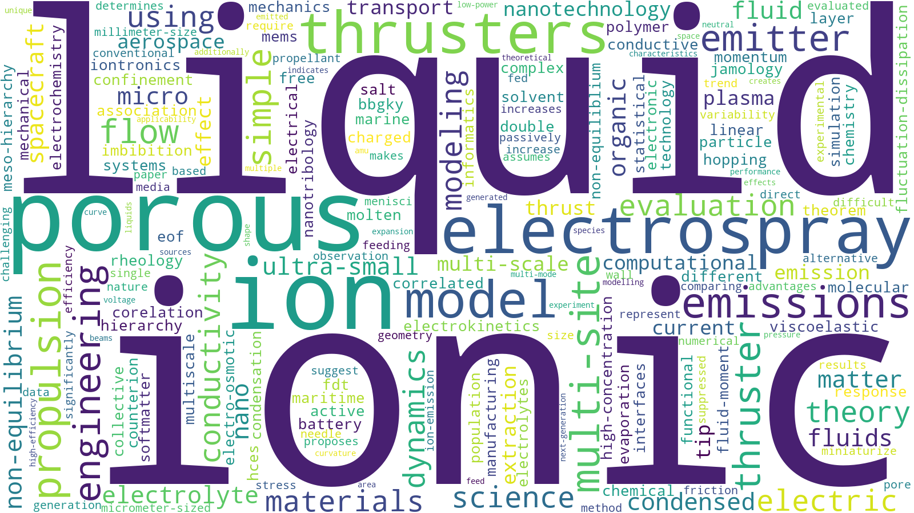

宇宙推進機の研究をしています。特に、超小型・高効率な推進性能が期待できるイオン液体エレクトロスプレースラスタという電気推進（イオンエンジン）を扱っています。イオン液体・濃厚電解液のイオンダイナミクスに興味があります。
Researching space propulsion, especially ionic liquid electrospray thrusters. Interested in developing theoretical models of ion dynamics in the liquid state.

掲載記事など:
- [web article 1](https://www.isas.jaxa.jp/topics/003764.html)
- [web article 2](https://www.isas.jaxa.jp/home/research-portal/people/2025/1006/?utm_source=isasweb&utm_medium=content&utm_campaign=links)

リンク 
- [個人のホームページ](https://takagi-koki-homepage.pages.dev/)
- CV([Japanese](./CV_jp.pdf))/(English)

研究の興味:

  

